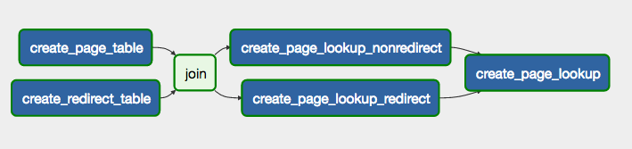

# Demotrends using Apache Airflow

If you want to use [Apache Airflow](https://github.com/apache/incubator-airflow) to manage the Demotrends workflow, you can make use of following 2 python scripts:

## process_static_data.py
Should run once to create `page` and `redirect` table in Hive. Ideally one should download [enwiki-latest-page.sql.gz](http://dumps.wikimedia.org/enwiki/latest/enwiki-latest-page.sql.gz) and [enwiki-latest-redirect.sql.gz](http://dumps.wikimedia.org/enwiki/latest/enwiki-latest-redirect.sql.gz) and load them in mysql instance and then use DB Import (Sqoop) to populate the data for these 2 hive tables. But for simplicity Qubole has done it and placed data on S3. One just need to create hive tables against them. 

## process_daily_data.py
This should run after `process_static_data` finishes successfully. It'll run daily to fetch daily raw pagecount data from wikipedia archives. It also filters data and process it to final table called `normalized_pagecounts`. As the wikipedia archives doesn't have upto date data, one should always do backfilling manually, instead of letting scheduler to execute it. Also make sure you fill proper S3 location before schedulling this script. 

PS: Please make sure that you've already setup Airflow to work with Qubole. See section [Setting up Airflow with Qubole](https://www.qubole.com/blog/product/open-source-integration-of-airflow-and-qubole/) OR you can make use of [Qubole's Airflow as a Service](http://docs.qubole.com/en/latest/user-guide/airflow/index.html).

